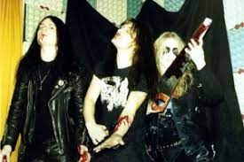

<h1 aling="center">Hi I'm W.daniel</h1>
<p align="center">
  
</p>

## User:checkered_flag:

```Estudante de TI```

```Técnico em Hardware de computadores```

```Python e C é a minha meta ```


``` python
#Follow me
print("Olá mundo")
```

<h2 aling = "center"> Certificações </h2>

> Hardware e montagem de computadores 


## Aplicações criadas:
- [IP-domain](https://github.com/CyberTerrorist-x/ip-domain)
- [CEP-br](https://github.com/CyberTerrorist-x/cep-br)

## Forks:
- [node-cep](https://github.com/CyberTerrorist-x/node-cep)
- [Jogo](https://github.com/CyberTerrorist-x/jogo)

## Organizações:
- [SigitSec](https://github.com/orgs/SigitSec/)
 


<h2 aling="left">Instagram: @daniewkiwi</h2>
